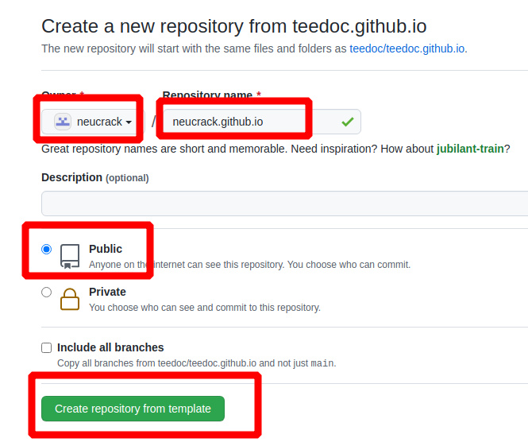

## Install python3

Need to install `Python3` first (only support `Python3`)

For example, on `Ubuntu`:
```shell
sudo apt install python3 python3-pip git
```

`Windows` and `macOS` please go to [Official Website Download](https://www.python.org/downloads/)


## Install teedoc

Open the terminal and enter:

```shell
pip3 install teedoc
```

Later use the following command to update the software:
```shell
pip3 install teedoc --upgrade
```

> If your network uses `pypi.org` and the speed is very slow, you can choose other sources, such as Tsinghua tuna source: `pip3 install teedoc -i https://pypi.tuna.tsinghua.edu.cn/simple`

Now you can use the `teedoc` command in the terminal

If not, please check if the `Python` executable directory is not added to the environment variable `PATH`,
For example, it may be in `~/.local/bin`


## New Construction

Create an empty directory to store the document project

```shell
mkdir my_site
cd my_site
teedoc init
```

or

```shell
teedoc -d my_site init
```

This will automatically generate some basic files in the `my_site` directory


In addition, in addition to using the `init` command to generate a minimal project, you can also get a source code of the official website document and modify it based on the content of this document
```shell
git clone https://github.com/teedoc/teedoc.github.io my_site
```
or
```shell
git clone https://gitee.com/teedoc/teedoc.gitee.io my_site
```

## Install plugin

This will install the plugin according to the plugin settings of `plugins` in `site_config.sjon`

```shell
cd my_site
teedoc install
```

> The plug-in is also released in the form of `python` package, so this will download the corresponding plug-in from `pypi.org`. Similarly, other sources can also be used, such as Tsinghua tuna source: `teedoc -i https://pypi. tuna.tsinghua.edu.cn/simple install`

## Build an `HTML` page and start an `HTTP` service

```shell
teedoc serve
```

This command will first build all `HTML` pages and copy resource files, and then start an `HTTP` service
If you only need to generate pages, use

```shell
teedoc build
```


After displaying `Starting server at 0.0.0.0:2333 ....`, it is fine

Open the browser to visit: [http://127.0.0.1:2333](http://127.0.0.1:2333)


At the same time, you can see that there is an additional `out` directory under the directory, which is the generated static website content, directly copy it to the server and use `nginx` or `apache` for deployment.


## Create a new repository based on the template repository on github and use the pages service to quickly create a website

Using the teedoc official website template and the github pages function, you can quickly create a website of your own. You don't need to build and maintain your own server, you don't need to deploy an HTTPS certificate yourself, and you don't need any key configuration. It can be completed in 3 minutes.

However, the github pages service also has disadvantages, that is, some domestic network lines in China may not be accessible.

### Create a repository based on a template

* Visit [https://github.com/teedoc/teedoc.github.io](https://github.com/teedoc/teedoc.github.io), click `Use this template`


* Set the name of the new repository to `username or organization name.github.io`, select the public repository, and then confirm the submission


> Then use `git clone your repository address` to clone to the local

### Set up pages service

* Wait for the automatic build to generate a new branch `gh-pages`, you can click on the `Actions` column to view the progress of the automatic build, if a green tick appears, it means it is OK, if a red cross appears, the build fails Yes, where is the problem, you can click in to view the log according to the screenshot method below (you must submit a screenshot of the log) and submit [issue](https://github.com/teedoc/teedoc.github.io/issues/ new) feedback


If there is an error, you can click to view the error log according to the following figure:


* Set the `pages` service of the repository and select the `gh-pages` branch. If there is no such branch, the previous step has not been completed or an error occurred. You can view the issue submission [issue](https://github.com/ teedoc/teedoc.github.io/issues/new) feedback


* Then visit `username or organization name.github.io`, you will find a webpage, the content is exactly the same as `teedoc.github.io`!


